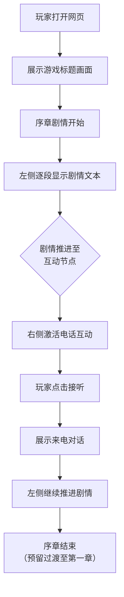

## 1. 产品概述

《神隐》是一款单一线剧情线索推理类网页游戏，玩家扮演主角在父母神秘失踪后，通过破解加密便签、收集线索、逐步揭开真相。游戏共 7 个推理关卡，首章为「天泉山庄神隐事件」，整体采用固定左引导右交互的两栏布局。

- **目标用户**：喜爱悬疑推理、解谜游戏的玩家
- **核心体验**：沉浸式剧情代入感 + 场景交互式推理
- **产品定位**：Web 端可直接访问、无需下载的轻量级剧情游戏

## 2. 核心功能

### 2.1 用户角色

| 角色 | 说明 |
|------|------|
| 玩家 | 无需注册登录，打开网页即可开始游戏，进度暂存在浏览器本地 |

### 2.2 功能模块

1. **序章页面**：剧情引导 + 电话互动场景，为后续完整关卡做模板
2. **关卡页面**（后续扩展）：7 个推理关卡，每个关卡包含独立剧情和谜题
3. **存档系统**（后续扩展）：本地存档，支持继续/重开

### 2.3 页面详情

| 页面名称 | 模块名称 | 功能描述 |
|----------|----------|----------|
| 序章 | 剧情引导区（左侧） | 逐段展示故事文本，包含淡入/打字机效果，玩家点击推进剧情 |
| 序章 | 互动场景区（右侧） | 电话界面模拟，包含来电显示、接通/挂断交互、对话文本展示 |
| 序章 | 顶部导航栏 | 游戏标题《神隐》、章节名称、设置按钮（预留） |

## 3. 核心流程

## 4. 用户界面设计

### 4.1 设计风格

- **整体基调**：暗黑悬疑风，融入中式水墨质感，营造神秘、压抑、引人探索的氛围
- **主色调**：深墨色背景（#0a0a0f），琥珀金点缀（#c9a96e），纸张米白用于文本区域（#f5f0e8）
- **辅助色**：暗红用于强调/警示文字（#8b2e2e），灰蓝用于次要信息（#6b7b8d）
- **字体选择**：
  - 中文标题：使用衬线风格字体（方正清刻本悦宋或类似），体现古朴质感
  - 正文：使用易读的无衬线字体，配合适中的行高
- **布局风格**：左右固定分栏，左侧约 45% 宽度为剧情引导区，右侧约 55% 为互动场景区，中间以细微分割线或阴影过渡
- **视觉特效**：
  - 纸张纹路背景叠加，模拟旧便签/信封质感
  - 剧情文本淡入和打字机效果
  - 按钮微光呼吸效果，引导玩家互动
  - 电话来电时的震动动画

### 4.2 页面设计概览

| 页面名称 | 模块名称 | UI 元素 |
|----------|----------|---------|
| 序章 | 顶部导航栏 | 深色半透明背景，左侧显示「神隐」标题（衬线字体、琥珀金色），中间显示当前章节名「序章·天泉山庄神隐事件」，右侧预留设置图标按钮 |
| 序章 | 剧情引导区（左） | 仿旧纸张背景卡片，内嵌剧情文本容器，支持逐段滚动显示；底部显示「点击继续」提示（呼吸动画）；当前段落打字机逐字出现 |
| 序章 | 互动场景区（右） | 正中放置手机模型（圆角矩形深色面板），初始状态显示「来电中...」提示；玩家点击接听后显示对话气泡界面；对话文本以气泡形式依次出现 |
| 序章 | 背景层 | 全屏深色渐变色背景，叠加低透明度水墨纹理及噪点效果，营造层次感 |

### 4.3 响应式设计

- **桌面端优先**：基于 1440px 设计基准，左右分栏布局
- **平板适配**：1024px 以下改为上下布局（引导区在上，互动区在下），保持可读性
- **移动端适配**：768px 以下进一步压缩内边距，电话模型等比缩小，字体适当调整