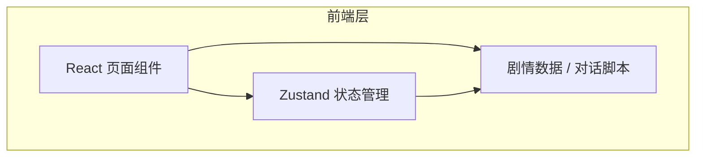

## 1. 架构设计



本项目为纯前端网页游戏，无需后端服务。所有剧情数据和游戏状态均在浏览器本地管理。

## 2. 技术选型

| 技术 | 版本 | 用途 |
|------|------|------|
| React | 18 | UI 框架 |
| TypeScript | 5 | 类型安全 |
| Vite | 6 | 构建工具 |
| Tailwind CSS | 3 | 样式框架 |
| Zustand | 5 | 状态管理 |
| Lucide React | latest | 图标库 |
| Framer Motion | 11 | 动画库（打字机效果、过渡动画等） |

## 3. 路由定义

| 路由 | 页面 | 说明 |
|------|------|------|
| `/` | 序章页面 | 游戏入口，展示序章剧情与电话互动 |

后续章节可扩展为 `/chapter/1`、`/chapter/2` 等路由。

## 4. 组件结构

```
src/
├── components/
│   ├── layout/
│   │   ├── TopNav.tsx          # 顶部导航栏
│   │   └── GameLayout.tsx      # 左右分栏布局容器
│   ├── story/
│   │   ├── StoryPanel.tsx      # 左侧剧情引导面板
│   │   ├── StoryText.tsx       # 剧情文本（含打字机效果）
│   │   └── StoryProgress.tsx   # 剧情推进控制（点击继续提示）
│   ├── interactive/
│   │   ├── PhoneScene.tsx      # 电话互动场景容器
│   │   ├── PhoneDialer.tsx     # 来电显示/接听界面
│   │   └── PhoneChat.tsx       # 通话对话气泡界面
│   └── ui/
│       ├── Typewriter.tsx      # 通用打字机效果组件
│       └── FadeIn.tsx          # 通用淡入效果组件
├── data/
│   └── prologue.ts             # 序章剧情脚本数据
├── store/
│   └── gameStore.ts            # 游戏全局状态
├── hooks/
│   └── useTypewriter.ts        # 打字机效果 hook
├── pages/
│   └── ProloguePage.tsx        # 序章页面
├── App.tsx
├── main.tsx
└── index.css
```

## 5. 数据模型

### 5.1 剧情脚本数据结构

```typescript
// 剧情段落
interface StorySegment {
  id: string;
  text: string;               // 剧情文本
  triggerInteraction?: string; // 触发互动的 ID（可选）
  waitForInteraction?: boolean; // 是否等待互动完成后才继续
}

// 对话条目
interface DialogueEntry {
  id: string;
  speaker: string;  // 说话人（'player' | 'caller' | 'system'）
  text: string;
  delay?: number;   // 延迟显示时间（ms）
}

// 互动场景定义
interface InteractionScene {
  id: string;
  type: 'phone_call';     // 互动类型（后续可扩展）
  dialogues: DialogueEntry[];
  autoAnswer?: boolean;   // 是否自动接听
}

// 序章数据
interface PrologueData {
  title: string;
  chapterTitle: string;
  storySegments: StorySegment[];
  interactions: Record<string, InteractionScene>;
}
```

### 5.2 游戏状态

```typescript
interface GameState {
  currentSegmentIndex: number;        // 当前剧情段落索引
  isTyping: boolean;                  // 是否正在打字
  activeInteraction: string | null;   // 当前活跃的互动 ID
  interactionPhase: 'idle' | 'ringing' | 'connected' | 'chatting' | 'ended';
  dialogueIndex: number;              // 当前对话索引
  isInteractionComplete: boolean;     // 当前互动是否完成
}
```

## 6. 无后端 / 无数据库

本项目为纯前端项目，所有剧情数据以 TypeScript 常量文件形式存放在 `src/data/` 目录中，游戏进度通过 Zustand 管理在内存中（后续可扩展至 localStorage 持久化）。